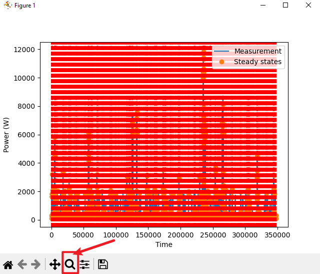
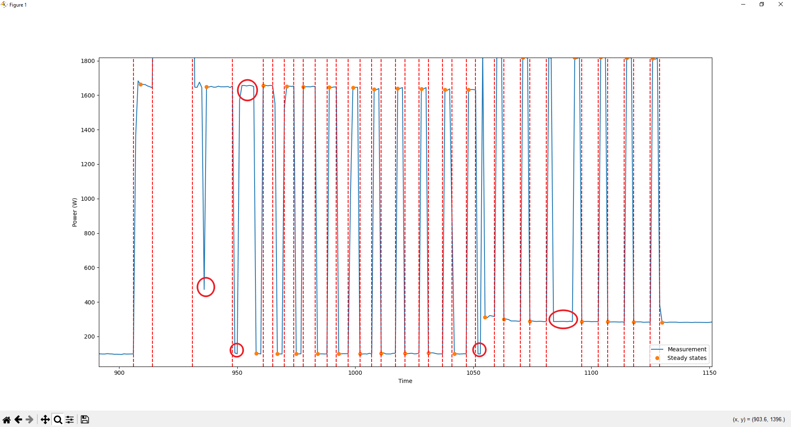

# On-Device NILM


## Prerequisites

Clone the repo:

```
$ git clone --recursive https://github.com/wuhanstudio/nilm
```

We use [uv](https://github.com/astral-sh/uv) to manage Python virtual environments.

```
Install uv: https://docs.astral.sh/uv/getting-started/installation/
```

Create the virtual environment:

```
$ cd nilm
$ uv sync
```

Then, activate the virtual environment:

```
# On Linux
$ source .venv/bin/activate

# On Windows
$ .\.venv\Scripts\activate
```

## REDD Dataset

In the `redd` folder, you can find the data collected from 6 buildings.

- redd_house1_x.csv
- redd_house2_x.csv
- redd_house3_x.csv
- redd_house4_x.csv
- redd_house5_x.csv
- redd_house6_x.csv

For each building, the data are stored in several csv files (e.g. Building 6).

- redd_house6_0.csv
- redd_house6_1.csv
- redd_house6_2.csv
- redd_house6_3.csv

You can concatenate the data in multiple `*.csv` files for Building 6:

```python
# Pattern 'redd_house6_*' and ending with .csv
building_pattern = f"redd_house6_*.csv"

csv_files = glob.glob("redd/" + building_pattern)
print("Building 6:", csv_files))

df = pd.concat((pd.read_csv(f) for f in csv_files), ignore_index=True)

print(df.head())
```

Each column is the activate power of an appliance.

> [!NOTE]  
> Not all buildings have the same applainces. (e.g. some buildings may not have fridge or microwave)

```
   Unnamed: 0  dish washer  electric space heater  electric stove  fridge  microwave  washer dryer        main
0           0          0.0                    0.0             0.0     6.0        4.0           0.0  103.790001
1           1          0.0                    0.0             0.0     6.0        4.0           0.0   99.630005
2           2          0.0                    0.0             0.0     6.0        4.0           0.0   99.169998
3           3          0.0                    0.0             0.0     6.0        4.0           0.0   99.709999
4           4          0.0                    0.0             0.0     6.0        4.0           0.0   98.919998
```

## Edge Detection

Before training a ML model, we need to find rising edges and falling edges.

```
$ python main_plot.py
```

The above script runs edge detection on Building 1 (main meter, fridge and microwave).



The image may look overwhelming because it has 350,000 data points. Please use the zoom-in button to look at small regions.



The edge detection algorithm is not perfect, there are some edges not being detected.

Try to improve the edge detector and think about what features needs to be extracted as inputs to Tsetlin Machine.

## Machine Learning (Tsetlin Machine)

Will add my Tsetlin Machine implementation here soon.

## Hardware Deployment

Deployment on Arduino, STM32 and ESP32.
